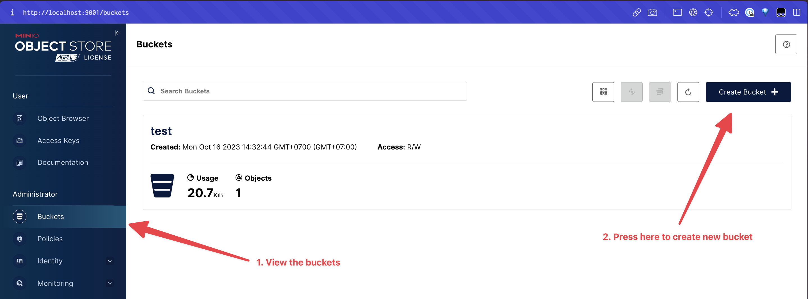
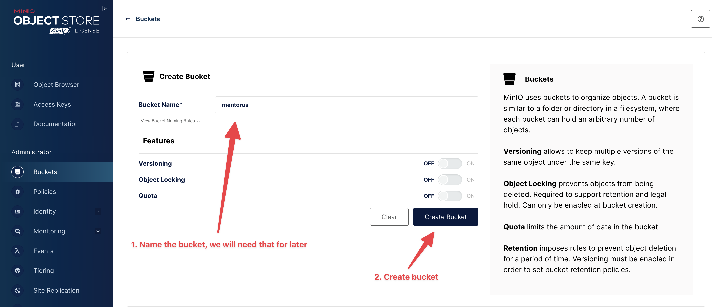
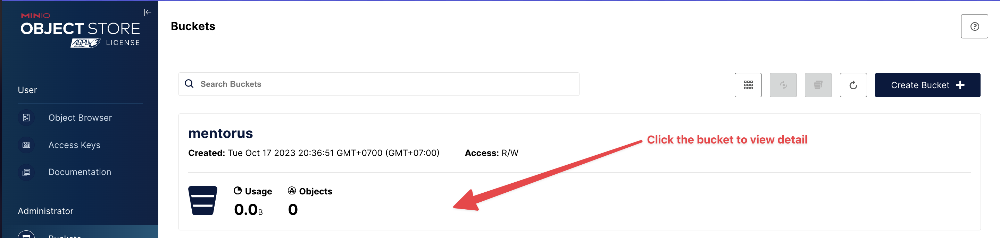
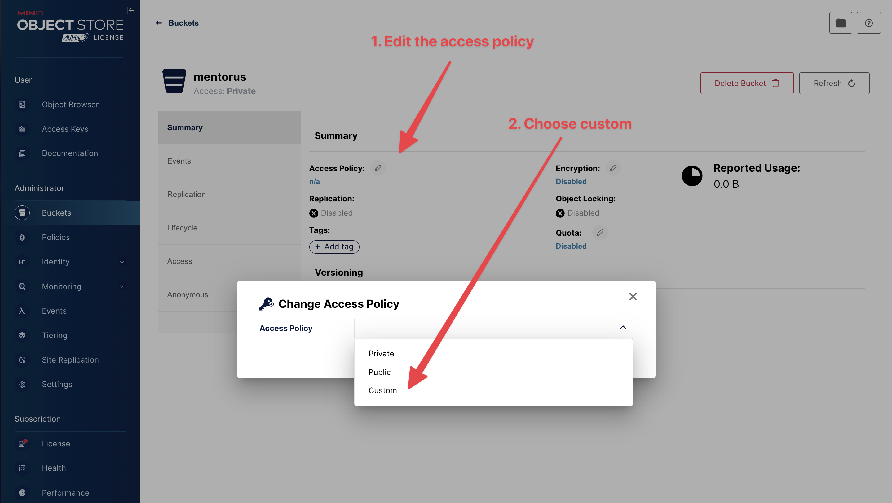
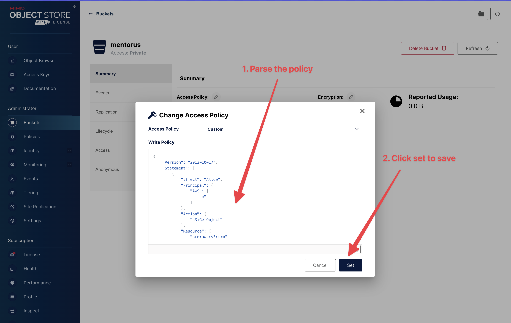
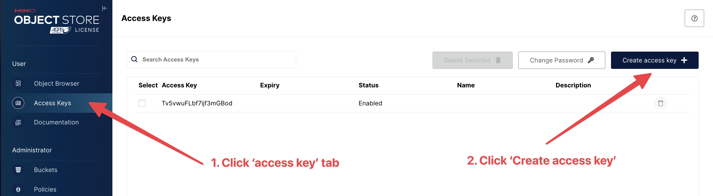
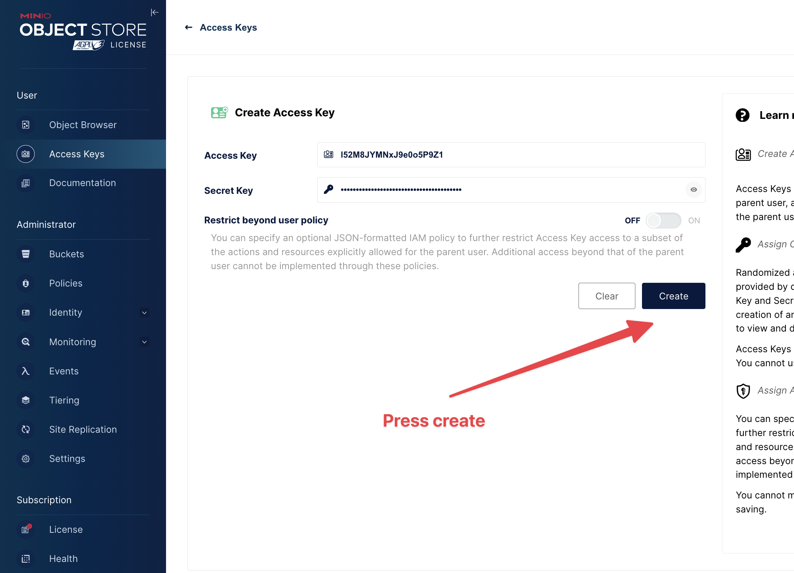
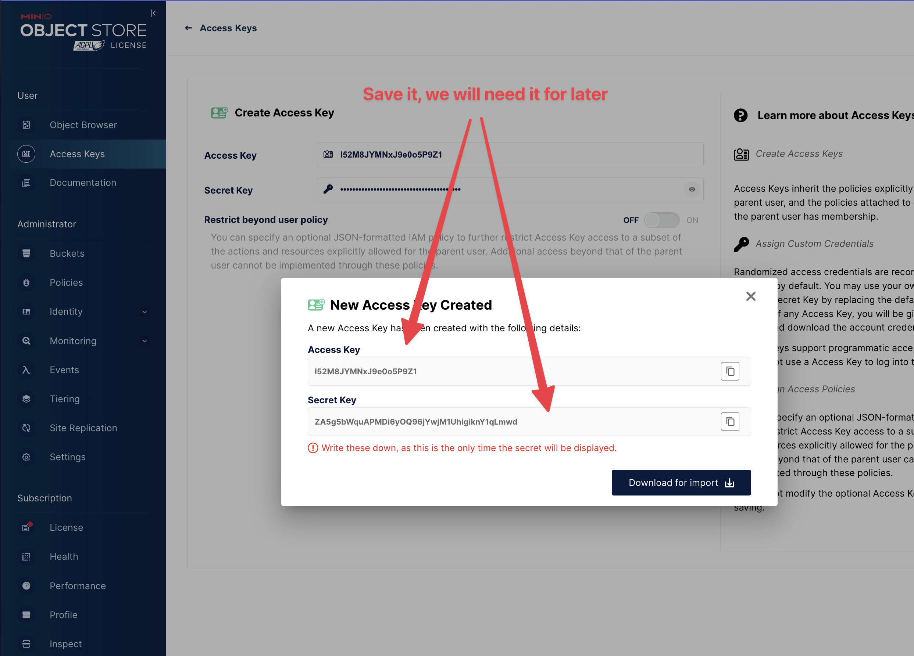

# Installation

**Prerequisites:**

- JDK 17 or higher (You can choose any distribution of OpenJDK from various vendors):

  - Microsoft OpenJDK: [Installation guide](https://learn.microsoft.com/en-us/java/openjdk/install)
  - Eclipse Temurin: [Installation guide](https://adoptium.net/installation/)
  - Azul Zulu: [Package download](https://www.azul.com/downloads/?package=jdk#zulu)

- MongoDB:

  - Install MongoDB Community Edition: [Installation guide](https://www.mongodb.com/docs/manual/administration/install-community/)

- Minio:

  - Install Minio server: [Installation guide](https://min.io/download)

**Optional**

- JetBrains IntelliJ IDEA Ultimate (For an easier way to run a Spring Boot application):

  - Install JetBrains Toolbox: https://www.jetbrains.com/toolbox-app/
  - Install IntelliJ Ultimate
  - Apply your educational license: [License application](https://www.jetbrains.com/shop/eform/students) (Currently, email addresses ending in @student.hcmus.edu.vn are not eligible)

## JDK

- Please verify that your Java version on your machine is 17 or higher:

```shell
java -version
```

- Example output:

```shell
openjdk version "17.0.8.1" 2023-08-24 LTS
OpenJDK Runtime Environment Zulu17.44+53-CA (build 17.0.8.1+1-LTS)
OpenJDK 64-Bit Server VM Zulu17.44+53-CA (build 17.0.8.1+1-LTS, mixed mode, sharing)
```

## Initial database

1. Open the terminal.
2. Run command `mongosh`
3. Inside mongosh, run the following commands:

```shell
use admin
db.createUser({
  "user": "root",
  "pwd": "password",
  "roles": [
    "userAdmin"
  ]
})
db.createCollection("mentordb")
use mentordb
db.user.insertOne({name: "Admin",email:"<YOUR EMAIL>","roles": ["SUPER_ADMIN","ROLE_USER"]})
```

**Note**: Please replace `<YOUR EMAIL>` with your actual email address.

## Configuration Minio

> Access Policy

```json
{
  "Version": "2012-10-17",
  "Statement": [
    {
      "Effect": "Allow",
      "Principal": {
        "AWS": ["*"]
      },
      "Action": ["s3:GetObject"],
      "Resource": ["arn:aws:s3:::*"]
    }
  ]
}
```

1. Go to the Minio admin panel, usually located at this URL: `http://localhost:9001`.
2. Log in and create a bucket.
   
3. Name the bucket and save its name for later.
   
4. Click on the bucket to view its details.
   
5. Edit the access policy and choose 'Custom.'
   
6. Paste the access policy provided above and save it.
   
7. Go to the 'Access key' tab and create a new access key.
   
8. Press the 'Create' button.
   
9. Save both the access key and secret key; you will need them later.
   

**Note:** After that you have

- URL of Minio, usually located at this URL: http://localhost:9000
- Name of the bucket (from step 3)
- Access key and secret key (from step 9)

## Next Steps

- Developing the application locally: [Development](docs/Development.md)
- Deploying the application to the server: [Deploy](docs/Deploy.md)
