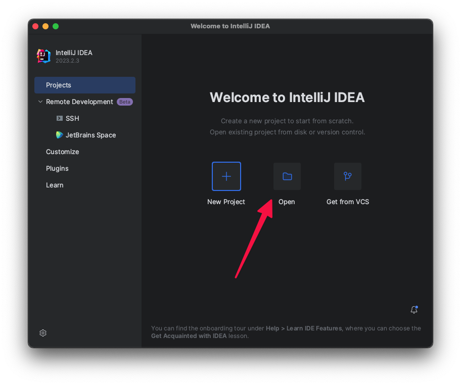
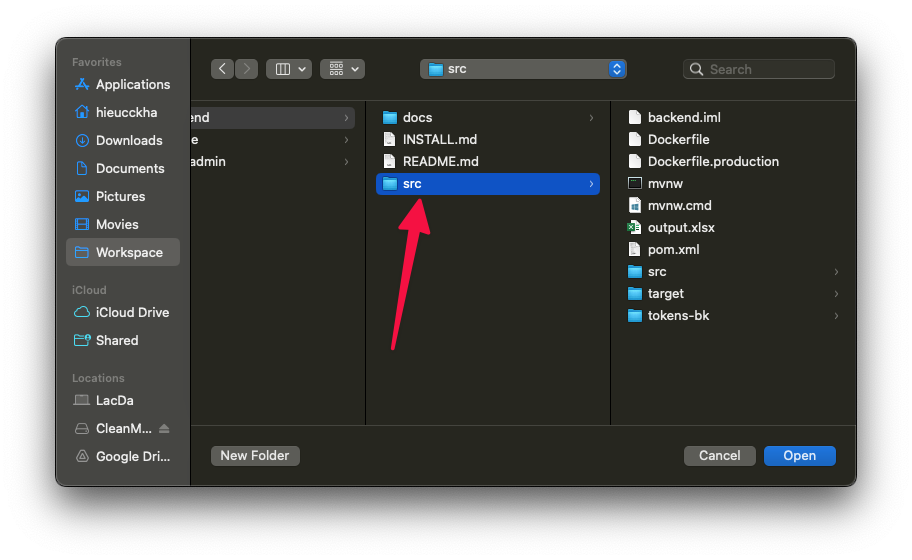
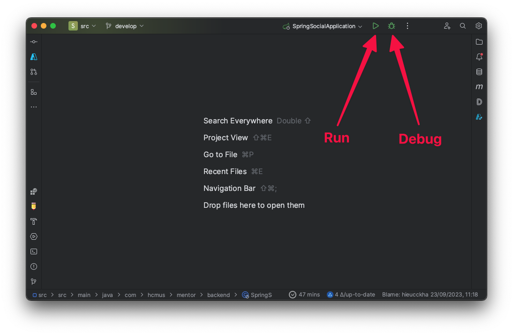
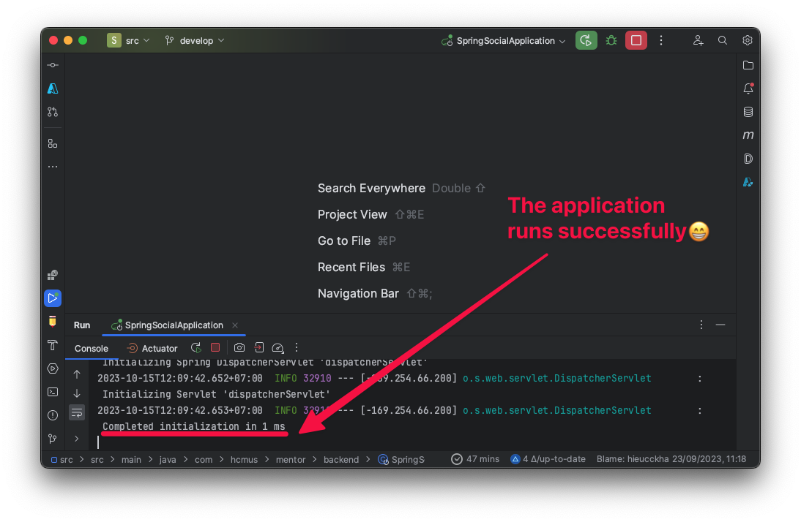
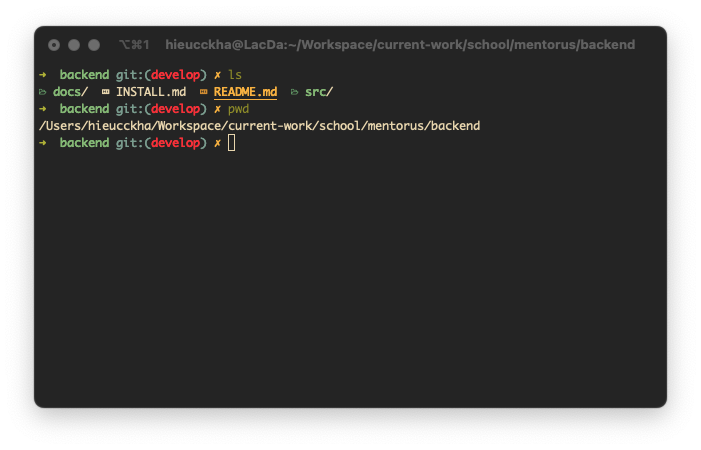
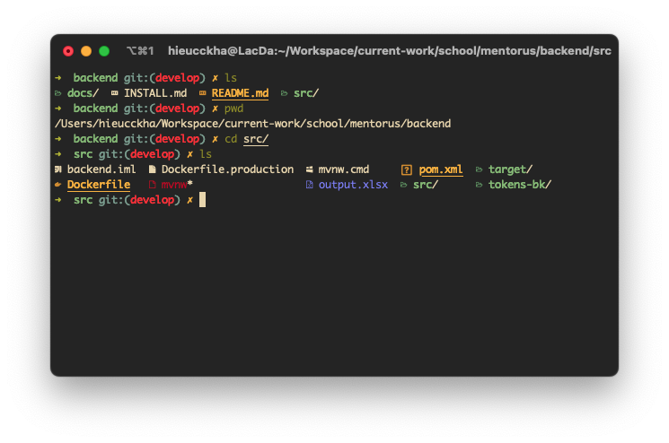
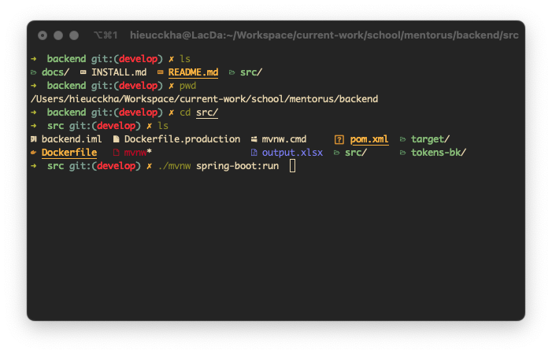
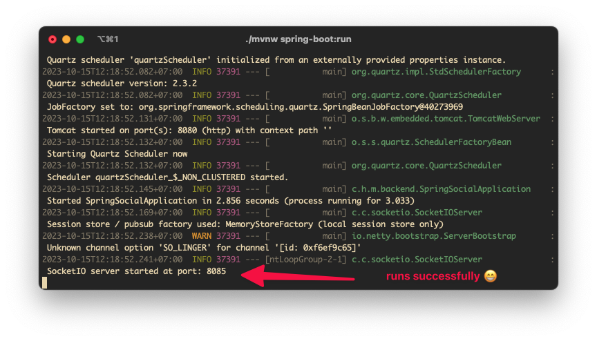

# Running the Application Locally

> Note: if you are from class, please ping the developer to get the credential file (Hiếu Nguyễn (hieucckha@gmail.com))

- Go to `/src/src/main/resources`
- Run this command to initial the credential:
```shell
op inject -i application-common.yml.template -o application-common.yml
op inject -i application-local.yml.template -o application-local.yml
```

> For more information, refer to: [Inject credentials using the 1Password CLI in different environments](https://developer.1password.com/docs/cli/secrets-config-files/#step-3-differentiate-between-environments)

- Add firebase credential file in `/src/main/resources/` with name `mentorus-firebase-adminsdk-20240402.json`

## Using JetBrains IntelliJ Ultimate:

- Open IntelliJ:
  
- Open the `src` folder:
  
- Press the start button to run the application:
  
- The application runs successfully:
  

> Swagger URL: `http://localhost:8080/swagger-ui/index.html`

## Using the Terminal:

- Open the terminal and navigate to the project folder:
  
- Go to the `src` folder:
  
- Run the command `./mvnw spring-boot:run` (use `mvnw.cmd` for running on Windows):
  
  
